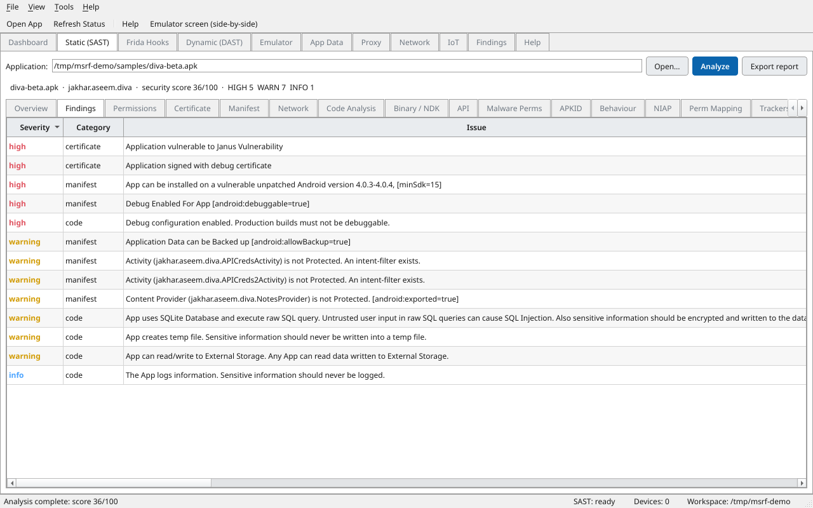
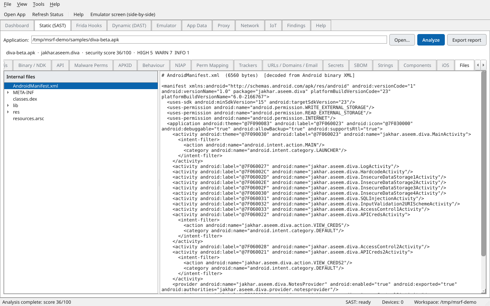
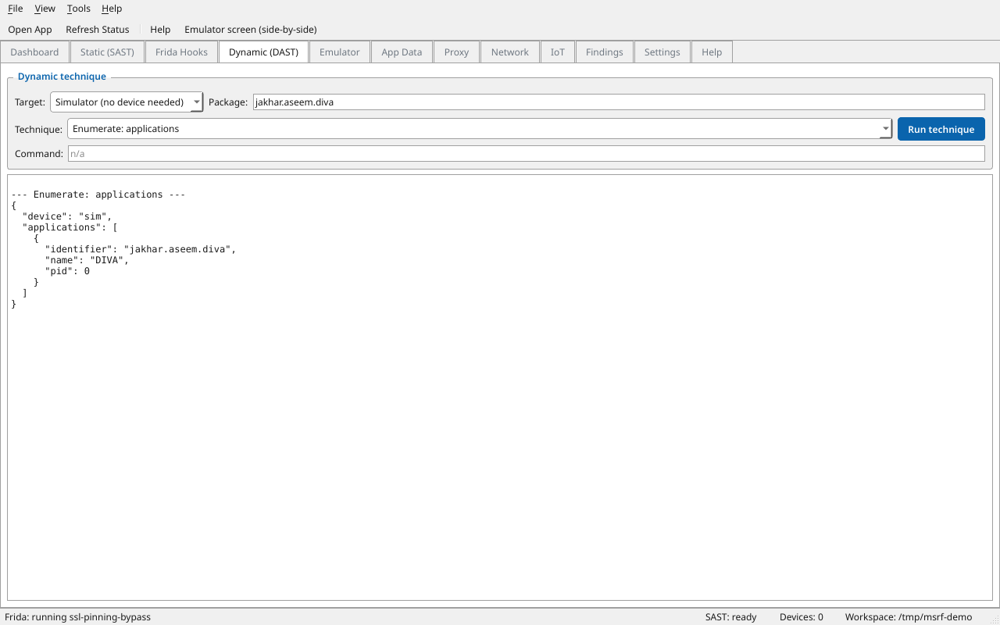
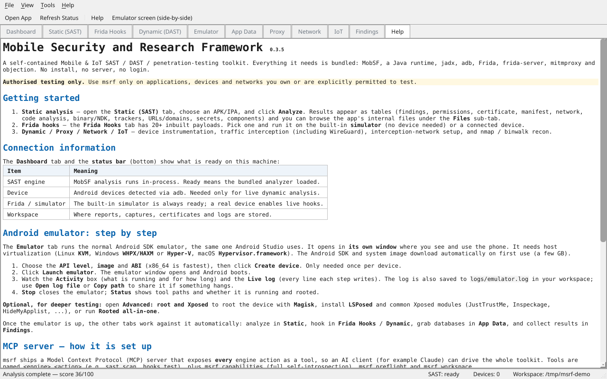
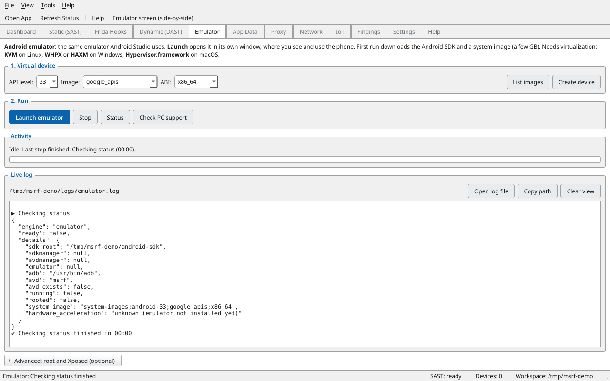
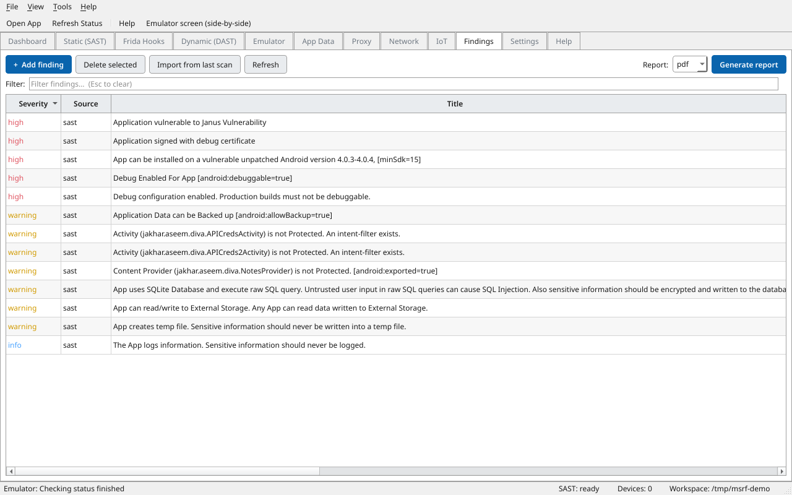

# Mobile Security and Research Framework

[](https://github.com/keyuraghao/Mobile_SAST_DAST_Pentest/actions/workflows/ci.yml)
[](https://github.com/keyuraghao/Mobile_SAST_DAST_Pentest/releases/latest)
[](https://github.com/keyuraghao/Mobile_SAST_DAST_Pentest/releases)


[](LICENSE)

Unified, cross-platform Mobile and IoT SAST / DAST / penetration-testing toolkit with a desktop app, a CLI, and an MCP server over MobSF, Frida, objection, mitmproxy, nmap, and binwalk.

Mobile Security and Research Framework glues best-in-class security engines together behind one consistent interface so you (or an AI agent) can run an assessment end to end: static analysis, dynamic analysis, runtime instrumentation, traffic interception from anywhere, and IoT/firmware recon.

> Authorised testing only. This toolkit is for assessing applications, devices, and networks that you own or have explicit written permission to test. You are responsible for complying with all applicable laws.

## Screenshots

The cross-platform desktop app (`mobiot ui`), a classic Windows-style application:

| Static analysis findings (tabular) | APK internal file browser |
|---|---|
|  |  |

| Dynamic (DAST) techniques | Help & MCP setup |
|---|---|
|  |  |

| Managed rooted emulator | Findings & reporting |
|---|---|
|  |  |

## Download

Prebuilt standalone desktop-app binaries for Linux, Windows and macOS are attached to each [GitHub Release](https://github.com/keyuraghao/Mobile_SAST_DAST_Pentest/releases/latest). Download the one for your OS and run it, no Python required:

- Linux: `mobiot-linux-x86_64`
- Windows: `mobiot-windows-x86_64.exe`
- macOS (Apple Silicon): `mobiot-macos-arm64`

Prefer pip? The same release also ships a universal wheel and sdist (`pip install mobiot-0.1.0-py3-none-any.whl`), and the desktop app then launches with `mobiot ui`.

## Highlights

- Extensible by design. Every capability is an `Engine` with `@action` methods registered in one place. New engines and actions automatically appear in the desktop app, the CLI, and the MCP server, with no extra wiring.
- Cross-platform. Linux, macOS, and Windows. Tools are discovered on `PATH`, the workspace uses OS-appropriate directories via `platformdirs`, and every subprocess is invoked shell-free.
- Three front-ends, one core. A PyQt6 desktop app (`mobiot ui`), a rich CLI, and a FastMCP server, all over the same engine layer.
- A library of 20+ inbuilt Frida hooks that run with one click or one command. SSL/root/anti-Frida/biometric bypasses plus monitors for crypto, keystore, SharedPreferences, SQLite, file I/O, clipboard, HTTP, intents, and logcat. You never write JavaScript unless a target is truly custom.
- Dynamic analysis anywhere. Wire a device into your interception network over Wi-Fi, USB (`adb reverse`), or a WireGuard tunnel so a physical device on any network routes its traffic back to your host.
- Built-in simulator. Generate and test payloads with nothing external attached (no emulator, SDK, or device).

## Engines

| Engine | Backend | What it does |
|--------|---------|--------------|
| `sast` | MobSF | Manage a native MobSF server; upload and statically scan APK/IPA/APPX; pull JSON/scorecard/PDF reports. |
| `dast` | MobSF + Frida | MobSF dynamic analysis; enumerate Frida devices/processes/apps; provision frida-server on demand. |
| `hooks` | Frida | 20+ inbuilt Frida hooks; generate and test payloads against a dummy app (DIVA) or a real device. |
| `runtime` | objection | Runtime exploration: SSL-pinning/root bypass, keystore and class listing, arbitrary commands. |
| `proxy` | mitmproxy | Capture traffic (regular/transparent/socks/upstream/wireguard); decode flows to JSON. |
| `network` | adb + mitmproxy | Set up the DAST network anywhere: host IPs, CA install, device proxy, WireGuard tunnel. |
| `iot` | nmap + binwalk | Host discovery, port/service scanning, firmware signature scan and extraction. |
| `sim` | built-in | A self-contained DIVA-like device and Frida-script simulator; generate and test payloads with nothing external attached. |
| `emulator` | Android SDK | Provision and drive a rooted Android emulator (Magisk + LSPosed + common Xposed modules + root checker). Runs where the SDK and host virtualization exist. |
| `appdata` | adb + sqlite | Grab a running app's databases and shared_prefs (from a device or the simulator sample data) and open them (SQLite tables/rows, XML). |
| `findings` | built-in | Central store of all findings; auto-imports static-analysis results, accepts custom findings, and generates reports in PDF/HTML/XLSX/CSV/JSON/Markdown. |

## Requirements

- Python 3.12+
- Python dependencies install automatically (`pip install -e .`).
- External tools discovered on `PATH` (install what you need): `adb` (Android platform-tools) for device engines; `nmap` and `binwalk` for the `iot` engine; `wkhtmltopdf` for MobSF PDF reports (optional). `frida`, `objection`, and `mitmproxy` install as Python dependencies (extras below).

## Install

From this project root (inside your virtualenv):

```bash
pip install -e ".[all,dev]"      # toolkit + GUI + frida/objection/mitmproxy/qr + dev tools
```

Minimal install (no heavy backends):

```bash
pip install -e .
```

MobSF is expected as a checkout under `mobsf/` (already present here) and is installed into the same environment.

## Quick start

```bash
# See every engine and action
mobiot info

# Health-check what is ready on this machine
mobiot preflight

# --- Static analysis ---
mobiot sast start-server
mobiot sast scan ./app.apk
mobiot sast report <HASH>
mobiot sast pdf <HASH>

# --- Frida payloads (tested on DIVA) ---
mobiot hooks list-templates
mobiot hooks generate --template hook-method --params '{"CLASS":"jakhar.aseem.diva.APICreds","METHOD":"access"}'

# Test with nothing external attached (built-in simulator):
mobiot sim status
mobiot sim run-hook --template ssl-pinning-bypass
mobiot hooks test --template ssl-pinning-bypass --device-id sim

# Or against a real rooted device/emulator:
mobiot dast provision-frida-server        # fetches matching frida-server on demand
mobiot hooks test --template ssl-pinning-bypass

# --- Intercept traffic anywhere ---
mobiot proxy start-capture --mode regular
mobiot network install-ca
mobiot network setup-local                # Wi-Fi, or add --use-reverse for USB
mobiot network setup-anywhere             # WireGuard tunnel + QR for a remote device

# --- IoT / firmware ---
mobiot iot host-discovery 192.168.1.0/24
mobiot iot port-scan 192.168.1.10 --ports 1-1024
mobiot iot firmware-scan ./firmware.bin
```

Every command prints JSON, so output pipes cleanly into `jq` or other tooling.

## Desktop app

A cross-platform PyQt6 GUI over the same engines:

```bash
pip install -e ".[gui]"      # or ".[all]"
mobiot ui                    # launches the desktop app
```

Tabs: Dashboard (engine readiness), Static (scan, scorecard, findings, PDF), Frida Hooks (one-click inbuilt hook library, run on the built-in simulator or a real device), Dynamic, Proxy, Network, and IoT. Every action runs on a worker thread so the UI never freezes.

## MCP server

Run the server so an MCP client (for example Claude) can drive the whole toolkit:

```bash
mobiot serve                       # stdio (default)
mobiot serve --transport http --port 8765
```

Each engine action is exposed as a tool named `<engine>_<action>` (for example `sast_scan`, `hooks_test`, `network_setup_anywhere`), plus `mobiot_preflight` and `mobiot_version`.

Example MCP client config (stdio):

```json
{
  "mcpServers": {
    "mobiot": { "command": "mobiot", "args": ["serve"] }
  }
}
```

## Configuration

Resolved in order: explicit args, then `MOBIOT_*` env vars, then a TOML config file, then defaults. The default config path is the per-user config dir (see `mobiot info`).

```toml
# config.toml
workspace = "~/.local/share/mobiot"
log_level = "INFO"

[mobsf]
url = "http://127.0.0.1:8000"
port = 8000
# api_key = "..."   # otherwise auto-generated and persisted
# Slim/offline profile (defaults shown): fast startup, no runtime downloads, system jadx, headless REST-only.
offline_profile = true
use_system_jadx = true
api_only = true
disable_authentication = true
async_analysis = false
domain_malware_scan = false
vt_enabled = false

[proxy]
mode = "regular"        # regular | transparent | wireguard | socks5 | upstream
listen_port = 8080
wireguard_port = 51820

[frida]
server_dir = "../Frida"  # holds frida-server-* binaries for provisioning
```

Point mobiot at it with `mobiot -c ./config.toml ...` or `MOBIOT_CONFIG=./config.toml`.

## Extending mobiot (adding a new engine)

```python
from mobiot.engines.base import Engine, action
from mobiot.registry import register

@register
class MyEngine(Engine):
    name = "myengine"
    summary = "What it does."

    @action("Do the thing.")
    def do_thing(self, target: str, count: int = 1) -> dict:
        return {"target": target, "count": count}
```

Register the module in `mobiot/registry.py::_load_builtins` (or load it as a plugin). It now appears in `mobiot info`, gets a CLI subcommand (`mobiot myengine do-thing`), a GUI presence, and an MCP tool (`myengine_do_thing`), with no other changes required.

## Development

```bash
pip install -e ".[gui,dev]"
ruff check src tests
QT_QPA_PLATFORM=offscreen pytest -q
```

## License and third-party tools

mobiot is released under GPL-3.0-only (it integrates GPL-licensed MobSF). The wrapped tools keep their own licenses: MobSF (GPL-3.0), Frida (wxWindows), objection (GPL-3.0), mitmproxy (MIT), nmap (NPSL), binwalk (MIT). Installing and using them is your responsibility.
